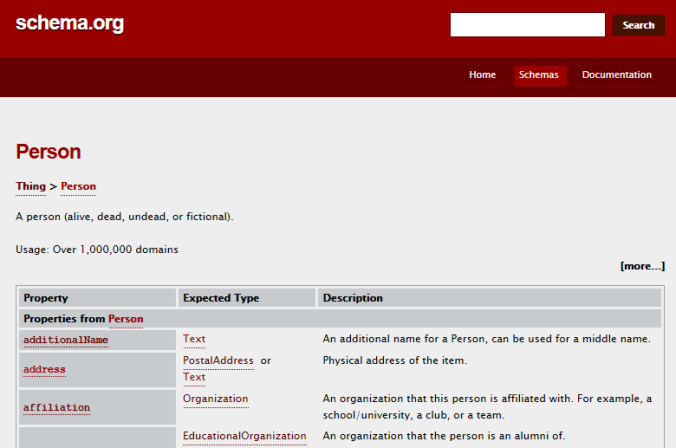
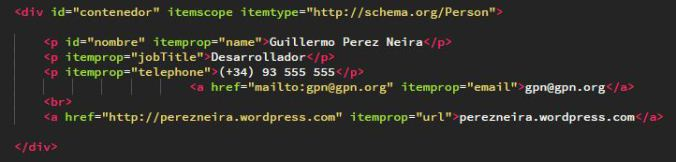
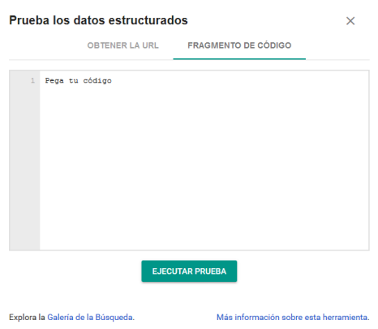
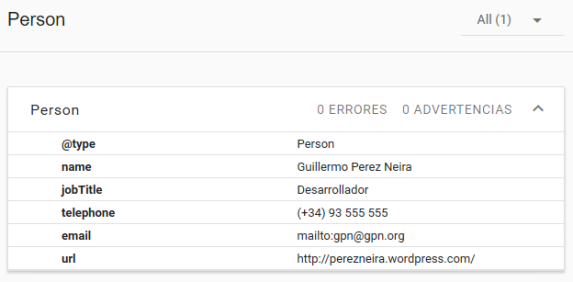
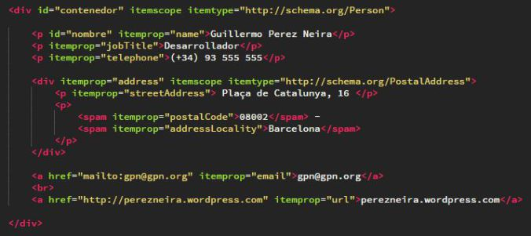
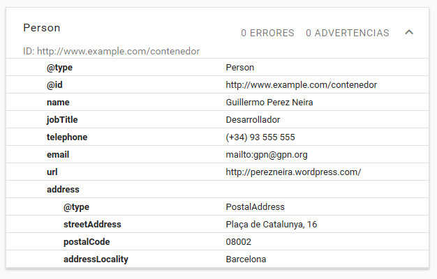

#HTML5 y los Microdatos

Mucho se habla de la web semántica y de sus beneficios en el posicionamiento de nuestras páginas en los buscadores.

**HTML5** es un gran aliado a la hora de incorporar esta característica en nuestro código, etiquetas como `<nav>`, `<section>`, `<article>`, etc. Tienen un valor semántico importante para los buscadores dándole más sentido a nuestro sitio web.

Pero podemos ahondar un poco más si especificamos más detalladamente el tipo de información que brindamos a los buscadores, esto lo hacemos utilizando los **Microdatos** o como los llama Google **Rich Snippets**.

### Microdatos o Rich Snippets

HTML5 permite añadir a sus etiquetas propiedades que contextualizan la información que brindamos y que los diferentes buscadores utilizaran para facilitar la indexación de los mismos.

Para que esto funcione está claro que tendremos que hablar el mismo lenguaje que el buscador que nos intenta indexar, es decir que podamos indicarle de forma inequívoca de que estamos hablando y cuál es el contenido. Esto lo logramos utilizando esquemas de datos predefinidos que podemos encontrar en ***Schema.org***

***Schema.org*** es una comunidad que tiene como objetivos crear, mantener y promover esquemas de datos estructurados para ser usados en webs, correos electrónicos y otros.

Contamos con una amplia definición de datos divididos en diferentes categorías como por ejemplo:

* Eventos
* Organización
* Personas
* Productos
* Ofertas

Hay muchas más y por lo que aprecie se van actualizando, por ejemplo la *** w3.org *** tiene publicado el esquema para los archivos de correo electrónico en [public-schemaorg@w3.org Mail Archives](https://lists.w3.org/Archives/Public/public-schemaorg/) .

En la siguiente imagen podemos apreciar la página de *** schema.org *** en donde se encuentran las propiedades de la categoría [Person](http://schema.org/Person) que podemos incluir en nuestra página.




#### Un pequeño ejemplo.

Si dentro de mi página web incorporara mis datos personales tal como se muestra a continuación, seguramente se vería correctamente y según los estilos hasta bonito.


>Guillermo Perez Neira  
Desarrollador   
Plaça de Catalunya, 16  
08002 Barcelona 
Tel. (+34) 93 555 555   
Mail: gpn@gpn.org   
Blog: perezneira.wordpress.com  

Pero el problema es que cuando los buscadores indexen mi página solo encontrara texto y nada que identifique de forma clara que datos tengo aquí. Para solucionar esto comenzaremos a enriquecer nuestro código.

Empecemos creando un `<div>` que tendrá como propiedad `itemscope`, esta propiedad indica que el contenido del `<div>` son datos estructurados y se complementa con `itemtype` que indica la URL desde donde se obtendrá la especificación del esquema que utilizaremos.

> ```<div id="contenedor" itemscope itemtype="http://schema.org/Person">```

Lo siguiente será agregar a nuestros datos las propiedades correspondientes a cada tipo de dato, por ejemplo `itemprop=”name”` indica que dentro de las etiquetas se especificara es el nombre.

 



Como podemos apreciar en el código dentro de cada etiqueta agregamos `itemprop` y su correspondiente definición, solo nos falta verificar que esto funciona correctamente. La forma de validar el código es utilizando la herramienta de pruebas de datos estructurados de Google que podemos encontrar en <https://search.google.com/structured-data/testing-tool> pegaremos el fragmento de código y ejecutaremos la validación del mismo.




El resultado de la prueba es la siguiente:



Podemos apreciar que se ha utilizado el esquema **“Person”** y las etiquetas **“name”, “jobtitle”, “telephone”, “email” ** y ** “url” **.  Como podemos apreciar en la parte superior de la imagen se encontraron ** “0 Errores” ** y ** “0 Advertencias”** 

Una vez validado nuestro código ya estamos seguros de que nuestra página se indexara correctamente.

 

Utilizar diferentes esquemas en nuestro código.

Hasta el momento todo está bien y correctamente estructurado, ¿pero que pasa si quiero agregar mi dirección física o la de mi despacho?, Básicamente tendríamos que agregar la propiedad “address” y entre las etiquetas escribir el conjunto de datos que indique  la dirección física.

Pero esto es un poco más complejo ya que una dirección es un conjunto de datos independientes que justos forman un lugar inequívoco. El país, la provincia, la ciudad, el código postal, la calle y su número de portal, todo esto podemos agruparlo utilizando un esquema llamado ** “PostalAddress” ** y dentro del utilizar los ** “itemprop” ** específicos como por ejemplo ** “streetAddres” , “addressLocality”, “postalCode”**, etc.

Este anidamiento de esquemas es conocido como “Embedded ítems” o “Microdatos Incrustados”, para llevar esto al ejemplo anterior insertaremos el código que se encuentra entre el telefono y el mail, donde el `<div>` agrupa la dirección con `itemprop=”address”` y lo esquematizamos mediante `itemscope itemtype=http://schema.org/PostalAddress `, en el interior del `<div>` etiquetamos cada elemento de la dirección y listo ya tenemos nuestra dirección lista para ser validada.



En el codigo se aprecia que el código postal y la localidad están en dos etiquetas spam separadas con su correspondiente `itemprop` y ambas se encuentran dentro de un párrafo `<p>` que las agrupa visualmente.

Al validar este código desde la herramienta de prueba de google nos retorna el siguiente análisis indicando que no hay errores ni advertencias.




Se puede apreciar cómo ** “address” ** indica la agrupación de las características de la dirección.

Espero que les sea útil y si les ha gustado compártanlo que es así como se aprende.


